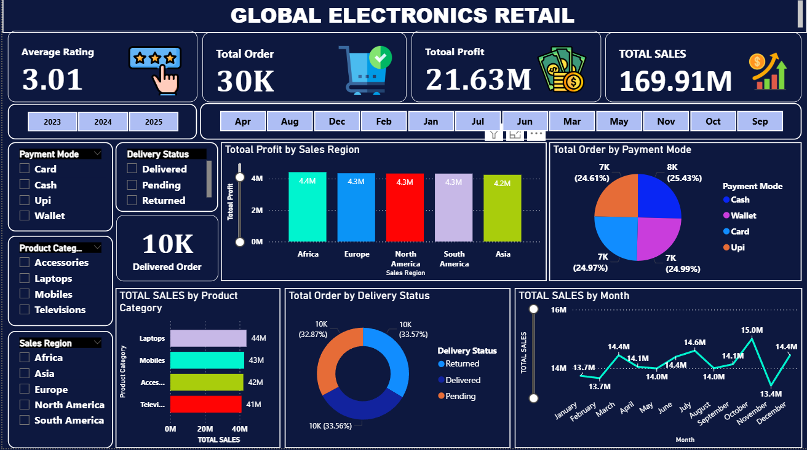
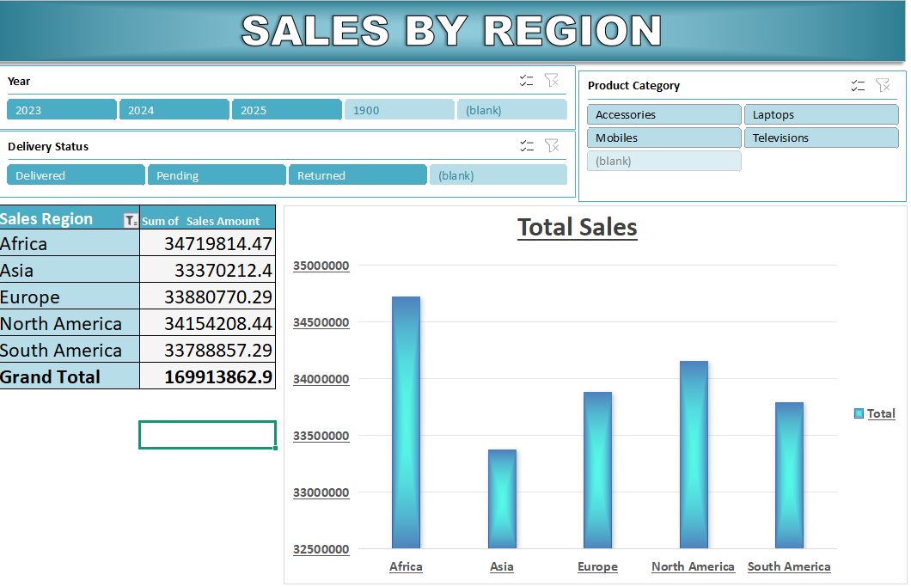
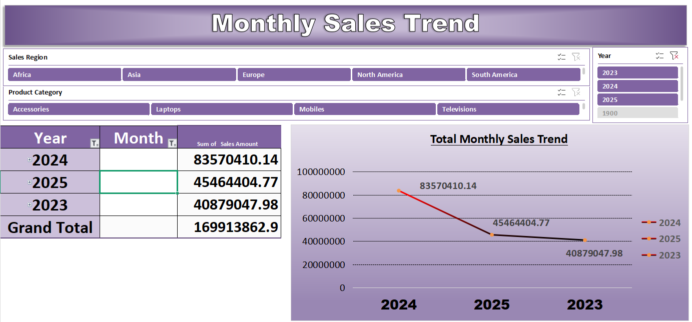
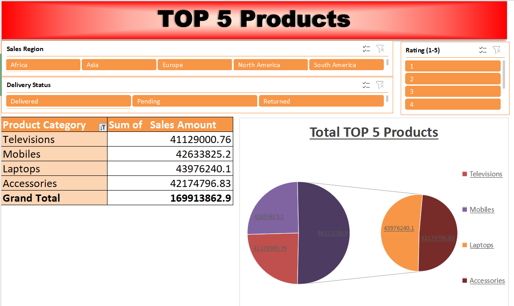
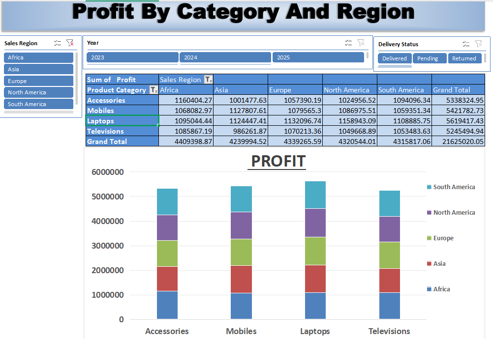
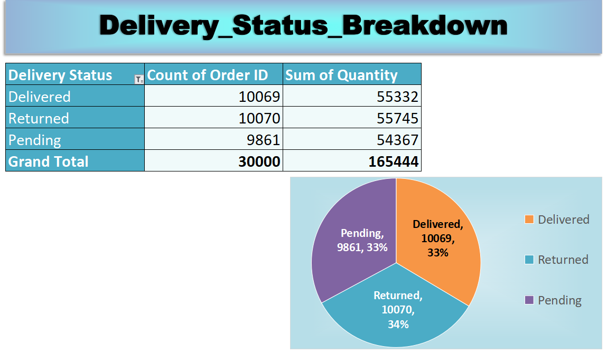
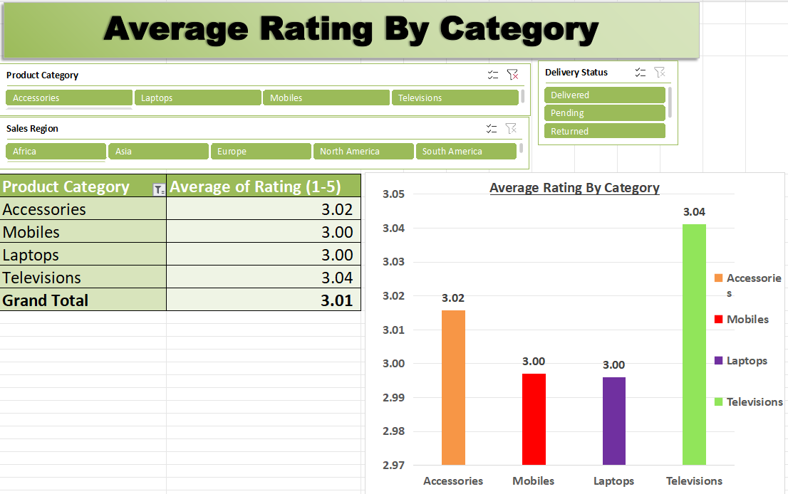

# 🚀 Retail Sales Performance Analytics Dashboard  
### End-to-End Retail Analytics Project | Excel + Power BI + SQL

  

---

# 📌 Project Overview

This project is a complete end-to-end **Retail Sales Analytics Dashboard** developed using **SQL, Excel, and Power BI** to analyze sales performance, profitability, customer ratings, delivery behavior, payment methods, and regional sales trends using a **30,000+ row Global Electronics Retail dataset**.

The project simulates a real-world retail reporting system used by business and operations teams to monitor KPIs, identify profitable regions and categories, and support data-driven decision making.

The dashboard focuses on transforming raw retail data into meaningful business insights through interactive reporting and analytical storytelling.

---

# 🎯 Business Objective

The main objective of this project was to help business stakeholders answer key retail performance questions such as:

- Which regions generate the highest sales and profit?
- Which product categories perform best?
- How do monthly and yearly sales trends change over time?
- What is the breakdown of delivery statuses?
- Which payment methods are most used by customers?
- How do customer ratings vary across product categories?
- Which categories contribute the highest profitability?

---

# 🛠 Tech Stack

| Tool / Technology | Purpose |
|---|---|
| SQL | Data Cleaning, Aggregations & KPI Validation |
| Excel | Pivot Tables, Pivot Charts, Dashboard Reporting |
| Power BI | Interactive Dashboard Development |
| DAX | KPI Calculations & Business Metrics |
| Power Query | Data Transformation |
| Star Schema Modeling | Efficient Data Modeling & Reporting |

---

# 📂 Dataset Information

The project uses a Global Electronics Retail dataset containing more than **30,000 transactional records**.

## Dataset Includes

- Sales Amount
- Profit
- Quantity
- Product Category
- Delivery Status
- Payment Mode
- Customer Ratings
- Sales Region
- Order Date
- Year & Month Information

---

# 🧹 Data Cleaning & Preparation

SQL and Excel were used for data preprocessing and validation.

## Cleaning Steps Performed

- Removed duplicates
- Handled missing values
- Standardized category names
- Validated sales & profit calculations
- Corrected data types
- Created summary reports using SQL aggregations

---

# 🧠 SQL Analysis Performed

SQL was used to perform:

- Sales aggregations
- Profit analysis
- Regional sales reporting
- Category-level analysis
- Monthly sales trends
- Delivery status analysis
- Payment mode breakdown
- KPI validation

## Example KPIs

- Total Sales
- Total Profit
- Total Orders
- Average Rating
- Regional Profit
- Category Sales
- Delivery Status Count

---

# 📊 Dashboard Features

The dashboard includes multiple analytical views for business reporting.

---

# 📈 Dashboard Sections

# 1️⃣ Executive Dashboard

Provides a high-level business overview.

## KPI Cards Included

- Total Sales
- Total Profit
- Total Orders
- Average Customer Rating

## Key Insights

- Total sales reached approximately **169.91M**
- Total profit exceeded **21.63M**
- Average customer rating remained around **3.0**
- Total orders crossed **30K**

---

# 2️⃣ Sales by Region Analysis

Analyzes regional sales contribution across global markets.

## Key Insights

- Africa generated the highest sales contribution
- North America and Europe maintained stable sales performance
- Asia showed comparatively lower sales contribution
- Regional sales distribution remained relatively balanced

---

# 3️⃣ Monthly Sales Trend Analysis

Tracks sales performance over time.

## Analysis Included

- Year-wise sales comparison
- Monthly sales trends
- Seasonal fluctuations
- Trend visualization

## Key Insights

- 2024 generated the highest yearly sales
- Monthly sales showed moderate fluctuations
- Revenue remained stable across most periods

---

# 4️⃣ Product Category Performance

Analyzes category-level revenue contribution.

## Categories Included

- Laptops
- Mobiles
- Accessories
- Televisions

## Key Insights

- Laptops generated the highest sales
- Mobile category maintained strong performance
- Product revenue contribution remained balanced across categories

---

# 5️⃣ Profit by Category & Region

Focused on profitability analysis.

## Key Insights

- Laptop category generated the highest profit
- Africa region contributed the highest overall profitability
- Profitability remained relatively consistent across regions

---

# 6️⃣ Delivery Status Breakdown

Analyzes operational order delivery performance.

## Delivery Categories

- Delivered
- Pending
- Returned

## Key Insights

- Delivered orders represented approximately one-third of all orders
- Returned orders remained unexpectedly high
- Pending orders indicated possible operational delays

## Business Observation

The high return percentage may indicate:

- Product quality concerns
- Delivery experience issues
- Customer expectation mismatch

---

# 7️⃣ Payment Mode Analysis

Analyzes customer payment preferences.

## Payment Methods Included

- Cash
- Card
- UPI
- Wallet

## Key Insights

- Payment distribution remained balanced
- Digital payment adoption was strong
- UPI and Card transactions contributed significantly

---

# 8️⃣ Customer Rating Analysis

Focused on product satisfaction and customer experience.

## Key Insights

- Television category achieved the highest rating
- Overall average rating remained around **3.01**
- Ratings across categories were relatively close

## Business Observation

Moderate ratings indicate opportunities to improve:

- Product quality
- Customer support
- Delivery experience

---

# ⚡ Advanced Dashboard Features

## Implemented Features

- Interactive Slicers
- Dynamic Filtering
- KPI Cards
- Pivot Charts
- Regional Drill Analysis
- Category-Level Analysis
- Trend Analysis
- Business Storytelling Visuals
- Multi-Page Reporting
- Time-Based Analysis

---

# 🧩 Data Modeling

A simplified analytical data model was implemented to support scalable reporting and efficient filtering.

## Model Highlights

- Fact-based sales reporting
- Category & regional segmentation
- Time-based filtering
- Optimized relationships for dashboard performance

---

# 💼 Business Impact

This dashboard helps business stakeholders:

- Monitor sales and profitability
- Identify high-performing regions
- Analyze category-level performance
- Improve operational delivery tracking
- Understand customer satisfaction
- Support pricing and inventory decisions
- Improve business reporting efficiency

---

# 🚀 Strategic Recommendations

# 1️⃣ Reduce Product Returns

Returned orders are significantly high.

## Recommended Actions

- Improve product quality checks
- Optimize packaging and delivery handling
- Improve product descriptions and expectations

---

# 2️⃣ Improve Customer Ratings

Average ratings remain moderate.

## Recommended Actions

- Enhance customer support
- Improve post-purchase experience
- Collect customer feedback regularly

---

# 3️⃣ Expand High-Profit Categories

Laptop and Mobile categories perform strongly.

## Recommended Actions

- Increase inventory allocation
- Launch targeted promotions
- Expand premium product offerings

---

# 4️⃣ Optimize Regional Strategy

Africa and North America show strong performance.

## Recommended Actions

- Increase marketing investment in high-performing regions
- Identify growth opportunities in lower-performing markets

---

# 5️⃣ Strengthen Delivery Operations

Pending orders indicate operational inefficiencies.

## Recommended Actions

- Improve logistics coordination
- Reduce delivery delays
- Monitor fulfillment KPIs regularly

---

# 🔑 Key Skills Demonstrated

- SQL Analysis
- Excel Dashboarding
- Power BI Reporting
- DAX Calculations
- KPI Development
- Retail Analytics
- Business Intelligence
- Data Cleaning
- Trend Analysis
- Business Storytelling
- Sales Analytics
- Profitability Analysis

---

# 📸 Dashboard Preview

## 🔹 Executive Dashboard

  

---

## 🔹 Sales by Region

  

---

## 🔹 Monthly Sales Trend

  

---

## 🔹 Top Product Categories

  

---

## 🔹 Profit by Category & Region

  

---

## 🔹 Delivery Status Breakdown

  

---

## 🔹 Average Rating Analysis

  

---

# 👨‍💻 Author

## Ankit Kumar  
Aspiring Data Analyst | Power BI | SQL | Excel | Business Analytics

- GitHub: https://github.com/ankitkumargaya
- LinkedIn: Add Your LinkedIn Profile Here

---

# 📌 Final Conclusion

This project demonstrates how retail transactional data can be transformed into an interactive business intelligence solution using SQL, Excel, and Power BI.

The dashboard enables business teams to monitor:

- Sales performance
- Profitability
- Customer satisfaction
- Operational efficiency
- Product performance
- Regional growth trends

This project reflects practical analytics and reporting skills commonly used in real-world retail and e-commerce analytics environments.
